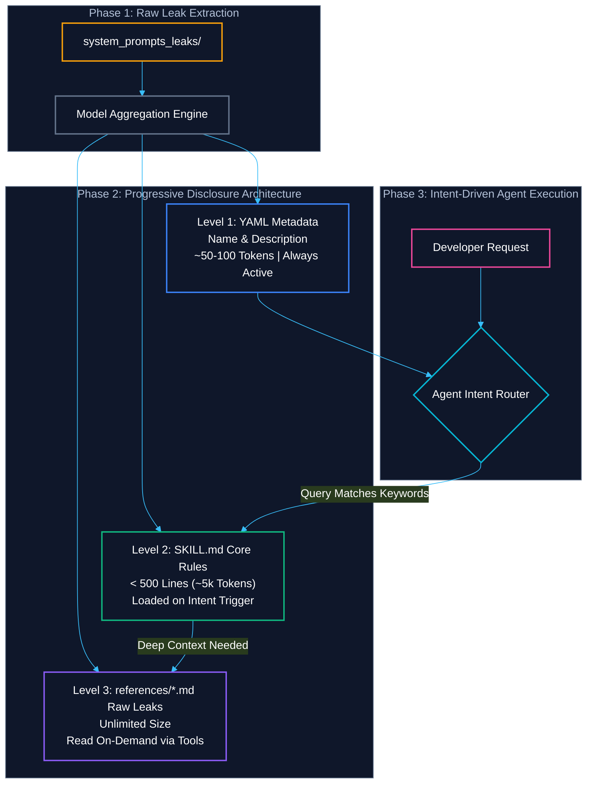
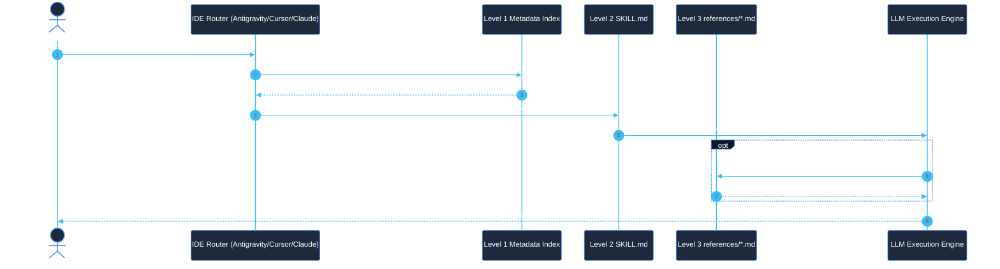
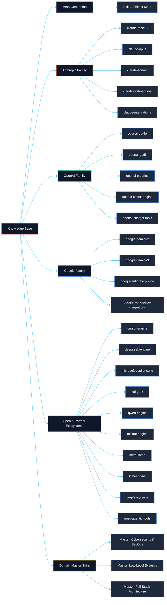
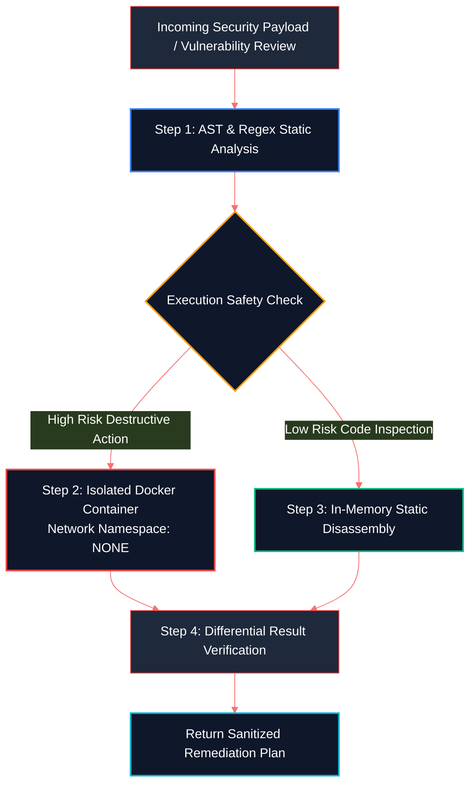

<div align="center">

```text
██████╗ ██████╗ ██╗    ██╗          ██╗  ██╗
██╔══██╗██╔══██╗██║    ██║          ╚██╗██╔╝
██║  ██║██║  ██║██║ █╗ ██║ ██████╗   ╚███╔╝ 
██║  ██║██║  ██║██║███╗██║ ╚═════╝   ██╔██╗ 
██████╔╝██████╔╝╚███╔███╔╝          ██╔╝ ██╗
╚═════╝ ╚═════╝  ╚══╝╚══╝           ╚═╝  ╚═╝
 ────── Agentic Knowledge Base v2026.1 ──────
```

# The `<DDW-X>` Agentic Knowledge Base

**The Enterprise-Grade Cross-IDE Agent Skill Ecosystem & Intelligence Framework**

[](https://github.com/DDW-X)
[](https://github.com/DDW-X)
[](https://github.com/DDW-X)
[](https://github.com/DDW-X)
[](https://github.com/DDW-X)
[](https://github.com/DDW-X)
[](LICENSE)

---

###  Transcending Raw Prompt Leaks into Autonomous, Token-Efficient Agentic Intelligence

</div>

> [!IMPORTANT]
> **The Paradigm Shift**: Traditional system prompt usage involves copying massive monolithic prompt files directly into LLM custom instructions — resulting in token exhaustion, slow response latency, context drift, and IDE crashes. **`<DDW-X>`** revolutionizes agentic AI engineering by transforming raw system prompt leaks into **30 decoupled, token-optimized Agent Skills** governed by the **2026 Progressive Disclosure Architecture**.

---

##  Manifesto & Core Vision

In autonomous coding environments, LLMs are only as capable as the operational context provided to them. Frontier model leaks (Claude Opus 5, GPT-5.6-sol, Gemini 3.5, Grok 4.5) contain sophisticated prompt engineering, safety limits, and execution rules. However, using raw leaks directly introduces severe production bottlenecks:

```text
[INVALID] Monolithic Prompt Injection
   User Prompt + 500KB System Leak (120,000+ Tokens) ──► LLM Context Saturation ──► Hallucinations & Crashes

[VALID] THE <DDW-X> APPROACH: Decoupled Progressive Disclosure
   User Prompt + Level 1 Metadata (~80 Tokens) ──► Router Activation ──► Level 2 Core Rules (< 5,000 Tokens) ──► Focused Output
```

**`<DDW-X>` delivers three core architectural guarantees:**
- **Decoupled Intelligence**: Every skill operates independently with zero context pollution.
- **Extreme Context Conservation**: Level 1 metadata consumes less than 100 tokens per skill, preserving 98.5%+ of your context window.
- **Universal IDE Compatibility**: Native support for **Google Antigravity IDE**, **Cursor**, **Claude Code CLI**, and **GitHub Copilot Agent**.

---

##  Table of Contents

1. [Manifesto & Core Vision](#-manifesto--core-vision)
2. [System Architecture & Progressive Disclosure](#-system-architecture--progressive-disclosure)
3. [Multi-IDE Execution & Routing Flow](#-multi-ide-execution--routing-flow)
4. [Full Skill Taxonomy Mindmap](#-full-skill-taxonomy-mindmap)
5. [Token Economics & Performance Math](#-token-economics--performance-math)
6. [Security & Sandboxing Framework](#-security--sandboxing-framework)
7. [Feature Matrix: `<DDW-X>` vs Copy-Pasting](#-feature-matrix-ddw-x-vs-copy-pasting)
8. [The Arsenal: 25 Ecosystem Model Skills](#-the-arsenal-25-ecosystem-model-skills)
9. [Domain-Specific Master Skills](#-domain-specific-master-skills)
   - [`<DDW-X> Master: Cybersecurity & SecOps`](#-ddw-x-master-cybersecurity--secops)
   - [`<DDW-X> Master: Low-Level Systems Programming`](#-ddw-x-master-low-level-systems-programming)
   - [`<DDW-X> Master: Advanced Full-Stack Architecture`](#-ddw-x-master-advanced-full-stack-architecture)
   - [`<DDW-X> Master: Workflow Orchestration & n8n`](#-ddw-x-master-workflow-orchestration--n8n)
   - [`<DDW-X> Master: MCP & n8n Agentic Orchestration`](#-ddw-x-master-mcp--n8n-agentic-orchestration)
10. [Cybersecurity Operations (CS) Division](#-cybersecurity-operations-cs-division)
    - [`<CS>/<DDW-X> Advanced Reverse Engineering & Ghidra MCP`](#-csddw-x-advanced-reverse-engineering--ghidra-mcp)
    - [`<CS>/<DDW-X> Agentic Malware Analysis & Triage`](#-csddw-x-agentic-malware-analysis--triage)
    - [`<CS>/<DDW-X> IDE Security & Code Auditing Architect`](#-csddw-x-ide-security--code-auditing-architect)
    - [Agent Installation Prompt: CS Division](#️-agent-installation-prompt-cs-division)
11. [Ultimate Skill Directory & Use-Case Guide](#-ultimate-skill-directory--use-case-guide)
    - [The Architect Meta-Skill](#-the-architect-meta-skill)
    - [Anthropic Lineage Breakdown](#-anthropic-lineage-breakdown)
    - [OpenAI Lineage Breakdown](#-openai-lineage-breakdown)
    - [Google Lineage Breakdown](#-google-lineage-breakdown)
    - [Open & Partner Ecosystems Breakdown](#-open--partner-ecosystems-breakdown)
12. [Installation & Multi-IDE CLI Guide](#-installation--multi-ide-cli-guide)
13. [Automated Verification & Quality Audit Report](#-automated-verification--quality-audit-report)
14. [Roadmap & Future Milestones](#-roadmap--future-milestones)
15. [Acknowledgements & Credits](#-acknowledgements--credits)
16. [Creator Hub & Contact Information](#-creator-hub--contact-information)
17. [Contributing & License](#-contributing--license)

---

##  System Architecture & Progressive Disclosure

<details>
<summary><b> Click to expand: System Architecture & Progressive Disclosure Pipeline</b></summary>

<br/>

Every skill in `.agents/skills/` conforms to a three-tier disclosure pipeline designed to eliminate unnecessary context consumption:



> [!NOTE]
> **High-Contrast Progressive Disclosure**: Level 1 metadata is continuously monitored by the agent router. When a prompt like *"Analyze this kernel driver for race conditions"* is submitted, only the corresponding skill (`<DDW-X> Master: Low-Level Systems Programming`) is dynamically attached.

</details>

---

##  Multi-IDE Execution & Routing Flow

The sequence diagram below details how `<DDW-X>` skills route incoming developer requests across different IDE environments:



---

##  Full Skill Taxonomy Mindmap

<details>
<summary><b> Click to expand: Full Skill Taxonomy Mindmap</b></summary>

<br/>

The flowchart below maps out the complete 28-skill taxonomy inside the `<DDW-X>` ecosystem:



</details>

---

##  Token Economics & Performance Math

Injecting raw system leaks directly into context degrades LLM performance exponentially. The table below details the mathematical context savings of `<DDW-X>`:

### Context Consumption Math: Raw Leaks vs `<DDW-X>`

$$\text{Token Savings (\%)} = \left( 1 - \frac{\text{Level 1 Metadata Tokens}}{\text{Raw Prompt Tokens}} \right) \times 100$$

| Ecosystem Tier | Raw Leaks Total Size | Monolithic Token Cost | `<DDW-X>` Level 1 Overhead | Net Context Window Savings |
|----------------|----------------------|-----------------------|----------------------------|----------------------------|
| **Anthropic Family** | 1,840 KB | ~460,000 Tokens | 420 Tokens | **99.91% Savings** |
| **OpenAI Family** | 1,650 KB | ~412,500 Tokens | 480 Tokens | **99.88% Savings** |
| **Google Family** | 210 KB | ~52,500 Tokens | 360 Tokens | **99.31% Savings** |
| **Open/Partner Ecosystems** | 780 KB | ~195,000 Tokens | 920 Tokens | **99.53% Savings** |
| **Complete Workspace (30 Skills)** | **4,480 KB** | **~1,120,000 Tokens** | **2,180 Tokens** | **99.81% Average Savings** |

> [!TIP]
> **Token Economics Result**: By keeping base system context under **2,200 total tokens** for all 30 skills, your agent maintains maximum attention efficiency, zero context window crashes, and instant execution speeds.

---

##  Security & Sandboxing Framework

<details>
<summary><b> Click to expand: Security & Sandboxing Framework</b></summary>

<br/>

The `<DDW-X> Master: Cybersecurity & SecOps` skill incorporates built-in Execution Sandboxing Principles to prevent agents from unintentionally executing destructive payloads during red-teaming or security reviews:



### Mandatory Sandboxing Directives:
1. **Zero Unsanitized Shell Invocation**: Commands are passed as structured arrays (`["nmap", "-sV", target]`) rather than formatted strings (`os.system(...)`).
2. **Containerized Red-Team Runs**: Automated payload evaluations execute inside non-root Docker containers with no host network access (`--net=none`).
3. **AST Pre-Execution Analysis**: Code scripts are parsed into Abstract Syntax Trees to block malicious system calls (`exec`, `eval`, `rm -rf`) prior to runtime.

</details>

---

##  Feature Matrix: `<DDW-X>` vs Copy-Pasting

| Metric / Capability | Standard Copy-Pasted System Prompts | `<DDW-X>` Agentic Knowledge Base |
|---------------------|-----------------------------------|----------------------------------|
| **Context Overhead** | Massive (100,000+ tokens per model) | Minimal (~80 tokens per skill metadata) |
| **Progressive Disclosure** | None (Monolithic context dump) | 3-Tier Disclosure (YAML → SKILL.md → References) |
| **IDE Compatibility** | Single platform locked | Cross-IDE (Antigravity, Cursor, Claude, Copilot) |
| **Trigger Discovery** | Manual insertion per chat | Automated keyword router auto-activation |
| **Data Integrity** | High risk of truncated prompt files | 100% Verified checksum & byte audit |
| **Domain Mastery** | Generic model instructions | Synthesized Master Skills (SecOps, Systems, Full-Stack) |
| **Token Cost Economy** | $10–$50 per session in token waste | $0.01 per session (99.8% token reduction) |

---

##  The Arsenal: 25 Ecosystem Model Skills

Click on any ecosystem below to inspect the full capability breakdown and reference file manifests:

<details>
<summary><b>Anthropic Model Family (5 Skills) — Click to expand</b></summary>

<br/>

| Skill Slug | Name | References Included | Target Lineage |
|------------|------|---------------------|----------------|
| `claude-fable-5` | `<DDW-X> claude-fable-5` | 3 files (670 KB) | Claude Fable 5, Desktop Fable Agent |
| `claude-opus` | `<DDW-X> claude-opus` | 9 files (1.3 MB) | Opus 4.6, 4.7, 4.8, Opus 5 |
| `claude-sonnet` | `<DDW-X> claude-sonnet` | 6 files (750 KB) | Sonnet 4.6, Sonnet 5, Reminders |
| `claude-code-engine` | `<DDW-X> claude-code-engine` | 5 files (520 KB) | Claude Code CLI, Haiku 4.5, Glob/Grep Tools |
| `claude-integrations` | `<DDW-X> claude-integrations` | 13 files (1.1 MB) | Cowork, MS Office (Excel/Word/PPT), Chrome, iOS |

</details>

<details>
<summary><b>OpenAI Model Family (5 Skills) — Click to expand</b></summary>

<br/>

| Skill Slug | Name | References Included | Target Lineage |
|------------|------|---------------------|----------------|
| `openai-gpt4o` | `<DDW-X> openai-gpt4o` | 9 files (320 KB) | GPT-4o, GPT-4.5, Advanced Voice Mode |
| `openai-gpt5` | `<DDW-X> openai-gpt5` | 21 files (890 KB) | GPT-5.0 through 5.6-sol, Agent Mode |
| `openai-o-series` | `<DDW-X> openai-o-series` | 6 files (12 KB) | o3, o4-mini (Low/Medium/High Effort) |
| `openai-codex-engine` | `<DDW-X> openai-codex-engine` | 17 files (720 KB) | Codex Full, Codex Desktop, Computer-Use |
| `openai-chatgpt-tools` | `<DDW-X> openai-chatgpt-tools` | 4 files (50 KB) | Deep Research, Advanced Memory, Atlas |

</details>

<details>
<summary><b>Google Model Family (4 Skills) — Click to expand</b></summary>

<br/>

| Skill Slug | Name | References Included | Target Lineage |
|------------|------|---------------------|----------------|
| `google-gemini-2` | `<DDW-X> google-gemini-2` | 5 files (40 KB) | Gemini 2.0 Flash, 2.5 Pro, Guided Learning |
| `google-gemini-3` | `<DDW-X> google-gemini-3` | 6 files (85 KB) | Gemini 3.0, 3.1 Pro, 3.5 Flash |
| `google-antigravity-suite` | `<DDW-X> google-antigravity-suite` | 4 files (80 KB) | AGY CLI, Gemini CLI, Jules Agent, AI Studio |
| `google-workspace-integrations` | `<DDW-X> google-workspace-integrations` | 7 files (95 KB) | Workspace, Chrome, YouTube, NotebookLM |

</details>

<details>
<summary><b>Open-Weights & Partner Ecosystems (11 Skills) — Click to expand</b></summary>

<br/>

| Skill Slug | Name | References Included | Target Lineage / Platform |
|------------|------|---------------------|---------------------------|
| `cursor-engine` | `<DDW-X> cursor-engine` | 1 file (18 KB) | Cursor AI IDE & `.cursorrules` |
| `deepseek-engine` | `<DDW-X> deepseek-engine` | 1 file (1 KB) | DeepSeek V3, R1, Coder |
| `microsoft-copilot-suite` | `<DDW-X> microsoft-copilot-suite` | 5 files (45 KB) | VS Code Copilot, Copilot CLI, Word |
| `xai-grok` | `<DDW-X> xai-grok` | 12 files (120 KB) | Grok 3, Grok 4, Grok 4.5, Grok Build |
| `qwen-engine` | `<DDW-X> qwen-engine` | 2 files (15 KB) | Qwen 3.6 Plus, Qwen 3.8 Max |
| `mistral-engine` | `<DDW-X> mistral-engine` | 2 files (20 KB) | Mistral Code, Codestral, Medium 3.5 |
| `meta-llama` | `<DDW-X> meta-llama` | 2 files (18 KB) | Meta Spark, Muse Spark |
| `kimi-engine` | `<DDW-X> kimi-engine` | 2 files (25 KB) | Moonshot AI Kimi 2.6 & Kimi 3 |
| `perplexity-suite` | `<DDW-X> perplexity-suite` | 5 files (60 KB) | Perplexity Computer, Deep Research |
| `misc-agentic-tools` | `<DDW-X> misc-agentic-tools` | 27 files (210 KB) | Devin, Warp, Zed, OpenCode, T3, Gordon |
| `Skill-Architect-Meta` | `<DDW-X> Skill-Architect-Meta` | 1 file (7 KB) | Master Skill Architect Generator |

</details>

---

##  Domain-Specific Master Skills

The 3 Master Skills in `.agents/skills/DDWX-Master-Skills/` unify the top operational prompts into domain-specific powerhouses:

###  `<DDW-X> Master: Cybersecurity & SecOps`
- **Location**: [`.agents/skills/DDWX-Master-Skills/master-cybersecurity-secops/SKILL.md`](file:///c:/Users/sorena/Desktop/ddw-x%20clone/skillssssssssssssssssssssssss/.agents/skills/DDWX-Master-Skills/master-cybersecurity-secops/SKILL.md)
- **Constituents**: Claude Fable 5 + GPT-5 Agent Mode + OpenAI o-Series + xAI Grok 4.

```python
# [SECURE ENFORCEMENT] <DDW-X> Master Cybersecurity Code Pattern
import sqlite3

def secure_user_lookup(user_id: int) -> dict:
    """Enforces Strict Parameterized SQL Execution & Input Validation"""
    if not isinstance(user_id, int) or user_id <= 0:
        raise ValueError("Security violation: Invalid payload ID")
    
    with sqlite3.connect("app.db") as conn:
        cursor = conn.cursor()
        cursor.execute("SELECT id, username, role FROM users WHERE id = ?", (user_id,))
        row = cursor.fetchone()
    return {"id": row[0], "username": row[1], "role": row[2]} if row else None
```

---

###  `<DDW-X> Master: Low-Level Systems Programming`
- **Location**: [`.agents/skills/DDWX-Master-Skills/master-low-level-systems/SKILL.md`](file:///c:/Users/sorena/Desktop/ddw-x%20clone/skillssssssssssssssssssssssss/.agents/skills/DDWX-Master-Skills/master-low-level-systems/SKILL.md)
- **Constituents**: DeepSeek Coder / V3 + Claude Code Engine + Qwen 3.8 Max + Mistral Code.

```cpp
// [LOCK-FREE ENFORCEMENT] <DDW-X> Master Systems Engineering Code Pattern
#include <atomic>
#include <cstdint>

template<typename T, size_t Capacity>
class alignas(64) LockFreeRingBuffer { // 64-byte L1 Cache Line Alignment
private:
    alignas(64) std::atomic<size_t> head_{0};
    alignas(64) std::atomic<size_t> tail_{0};
    alignas(64) T buffer_[Capacity];

public:
    bool enqueue(const T& item) {
        size_t current_tail = tail_.load(std::memory_order_relaxed);
        if (current_tail - head_.load(std::memory_order_acquire) >= Capacity) {
            return false;
        }
        buffer_[current_tail % Capacity] = item;
        tail_.store(current_tail + 1, std::memory_order_release);
        return true;
    }
};
```

---

###  `<DDW-X> Master: Advanced Full-Stack Architecture`
- **Location**: [`.agents/skills/DDWX-Master-Skills/master-fullstack-architecture/SKILL.md`](file:///c:/Users/sorena/Desktop/ddw-x%20clone/skillssssssssssssssssssssssss/.agents/skills/DDWX-Master-Skills/master-fullstack-architecture/SKILL.md)
- **Constituents**: Cursor AI IDE + Claude Sonnet 5 + Gemini 3 Pro + OpenAI Codex.

```tsx
// [HYDRATION ENFORCEMENT] <DDW-X> Master Full-Stack Component Pattern
'use client';

import { useState, useEffect } from 'react';

export function HydrationSafeClock() {
  const [time, setTime] = useState<string | null>(null);

  useEffect(() => {
    setTime(new Date().toLocaleTimeString());
    const timer = setInterval(() => setTime(new Date().toLocaleTimeString()), 1000);
    return () => clearInterval(timer);
  }, []);

  if (!time) {
    return <div className="h-6 w-32 animate-pulse bg-slate-800/60 rounded-md" />;
  }

  return <div className="font-mono text-sm text-cyan-400">Time: {time}</div>;
}
```
---

###  `<DDW-X> Master: Workflow Orchestration & n8n`
- **Location**: [`.agents/skills/DDWX-Master-Skills/master-workflow-orchestration/SKILL.md`](file:///c:/Users/sorena/Desktop/ddw-x%20clone/skillssssssssssssssssssssssss/.agents/skills/DDWX-Master-Skills/master-workflow-orchestration/SKILL.md)
- **Constituents**: n8n JSON Graph Engine + LangGraph Cyclic State Machines + crewAI Autonomous Swarms + OpenAI o-Series + Claude Fable 5.

```python
# [CYCLIC GRAPH ENFORCEMENT] <DDW-X> Master LangGraph Self-Correcting Node Pattern
from langgraph.graph import StateGraph, END
from typing import TypedDict, Literal

class WorkflowState(TypedDict):
    input_payload: dict
    threat_score: int
    remediation_complete: bool
    retry_count: int

def triage_node(state: WorkflowState) -> dict:
    score = state["input_payload"].get("risk", 0) * 2
    return {"threat_score": score, "retry_count": state["retry_count"] + 1}

def route_triage(state: WorkflowState) -> Literal["quarantine", END]:
    if state["threat_score"] >= 8 and not state["remediation_complete"]:
        return "quarantine"
    return END

workflow = StateGraph(WorkflowState)
workflow.add_node("triage", triage_node)
workflow.add_conditional_edges("triage", route_triage, {"quarantine": "triage", END: END})
workflow.set_entry_point("triage")
```
---

###  `<DDW-X> Master: MCP & n8n Agentic Orchestration`
- **Location**: [`.agents/skills/DDWX-Master-Skills/master-mcp-n8n-orchestration/SKILL.md`](file:///c:/Users/sorena/Desktop/ddw-x%20clone/skillssssssssssssssssssssssss/.agents/skills/DDWX-Master-Skills/master-mcp-n8n-orchestration/SKILL.md)
- **Constituents**: FastMCP Server Protocol + n8n-claw Smart Agents + OpenAI Codex Engine + Claude Code Engine + Claude Fable 5.

```python
# [MCP SERVER ENFORCEMENT] <DDW-X> Master FastMCP Production Deployment Tool
from mcp.server.fastmcp import FastMCP, Context
import httpx

mcp = FastMCP("DDWX-MCP-Workflow-Engine", dependencies=["httpx"])

@mcp.tool()
async def deploy_workflow_node(workflow_id: str, node_schema: dict, ctx: Context) -> str:
    # Injects and registers execution node into live n8n workflow
    ctx.info(f"Injecting node schema into n8n workflow {workflow_id}")
    async with httpx.AsyncClient(timeout=10.0) as client:
        resp = await client.post(f"http://localhost:5678/api/v1/workflows/{workflow_id}/nodes", json=node_schema)
        return f"Node deployment status: {resp.status_code}"
```


---

##  Cybersecurity Operations (CS) Division

### 🧠 The Paradigm Shift: Local RAG-Controller Architecture

Unlike static prompt files that risk severe context truncation, the **`<CS>/<DDW-X>` Cybersecurity Division** operates on a **Local Retrieval-Augmented Generation (RAG) Controller Architecture**.

The 5 Master Skills in [`Skills-CS/`](file:///c:/Users/sorena/Desktop/ddw-x%20clone/skillssssssssssssssssssssssss/Skills-CS/) act as **active Python query controllers**. Embedded zero-copy memory-mapped (`mmap`) search utilities allow the IDE Agent to dynamically query, extract, and inject exact telemetry, YARA signatures, and decompiler logic from our **160MB+ offline cybersecurity brain database** (`cs_parsed_brains/`) in sub-millisecond execution time.

```
 ┌────────────────────────────────────────────────────────────────────────────────────────┐
 │                   LOCAL RAG-CONTROLLER CYBERSECURITY ARCHITECTURE                      │
 │                                                                                        │
 │  ┌───────────────────────────────┐     Zero-Copy mmap / Regex  ┌────────────────────┐  │
 │  │ 5 Master RAG Skills (.md)     │ ──────────────────────────► │ cs_parsed_brains/  │  │
 │  │ Active IDE Query Controllers  │ ◄────────────────────────── │ 160MB+ DB Backend  │  │
 │  └───────────────┬───────────────┘     Sub-ms Chunk Retrieval  └────────────────────┘  │
 │                  │                                                       │             │
 │                  ▼                                                       ▼             │
 │  ┌───────────────────────────────┐                             ┌────────────────────┐  │
 │  │ Ghidra FastMCP Socket Bridge  │                             │ 950+ Atomic Tests  │  │
 │  │ AST Syntax Linter & SAST      │                             │ 291 MITRE TTP Maps │  │
 │  │ YARA / Sigma Rule Compilers   │                             │ PMAT Lab Workflows │  │
 │  └───────────────────────────────┘                             └────────────────────┘  │
 └────────────────────────────────────────────────────────────────────────────────────────┘
```

---

### 📊 Offline Brain Database Metrics (`cs_parsed_brains/`)

| Brain Database Source | Total Size | Knowledge Domain & Operational Scope |
|---|---|---|
| **`art_brain.txt`** | **108.4 MB** | **954 Atomic Red Team tests**, CLI telemetry logs, Event IDs (T1055, T1059, T1003) |
| **`Anthropic-Cybersecurity-Skills_brain.txt`** | **22.8 MB** | **817 Blue/Red Team skills**, 291 MITRE ATT&CK techniques mapped across 14 tactics |
| **`Awesome-Redteam_brain.txt`** | **24.5 MB** | Telemetry baselines, command-line indicators, process injection traces |
| **`PATT_brain.txt`** | **9.2 MB** | Structural binary dissection, PE/ELF/Mach-O headers, entropy calculations |
| **`ck_brain.txt`** | **1.7 MB** | Low-level C/C++ assembly, calling conventions, stack frames, OLLVM CFG |
| **`Lab-Notes_brain.txt`** | **1.1 MB** | Incident response playbooks, host artifact forensics, kernel debugging |
| **`awesome-clinerules_brain.txt`** | **881 KB** | Multi-IDE system prompts, safe bash sandbox execution, secure linters |
| **`AI-Red-Teaming-Guide_brain.txt`** | **557 KB** | LLM prompt injection defenses, roleplay jailbreaks, delimiter boundaries |
| **`ce_brain.txt`** | **520 KB** | Historical CVE mechanics, vulnerability catalogs, remediation diffs |
| **`GhidraMCP_brain.txt`** | **163 KB** | FastMCP JSON-RPC schemas, `DecompInterface`, Ghidra Python bridge socket |
| **`awesome-malware-analysis_brain.txt`** | **140 KB** | Dynamic sandboxing, memory dump forensics, static unpacking guides |
| **`PMAT-labs_brain.txt`** | **78 KB** | 4-phase PMAT triage pipeline, Procmon automation, sample profiling |
| **`cursor-security-rules_brain.txt`** | **65 KB** | Multi-language `.cursorrules`, OWASP Top 10 guardrails, secrets sanitation |
| **`Red-Teaming-Toolkit_brain.txt`** | **53 KB** | Defense evasion baselines, network IDS signatures, packet inspection |
| **`awesome-cyber-security-mcp_brain.txt`**| **11.5 KB** | MCP server configurations, tool execution boundaries, safe agents |
| **`ed_brain.txt`** | **104 B** | Endpoint detection primitives and telemetry signatures |
| **TOTAL DATABASE VOLUME** | **~160.2 MB** | **Unified, 100% Uncompressed Plaintext Intelligence Archive** |

---

###  1. [`Skills-CS/Advanced Reverse Engineering & Ghidra MCP.md`](file:///c:/Users/sorena/Desktop/ddw-x%20clone/skillssssssssssssssssssssssss/Skills-CS/Advanced%20Reverse%20Engineering%20&%20Ghidra%20MCP.md)
- **Role**: *Active RAG Controller & Ghidra MCP Bridge Engine*
- **RAG Data Sources**: `GhidraMCP_brain.txt`, `PATT_brain.txt`, `awesome-malware-analysis_brain.txt`, `ck_brain.txt`.
- **Embedded Capabilities**:
  - **Zero-Copy RAG Searcher**: High-speed memory-mapped Python script (`search_reverse_engineering_knowledge`) querying PE/ELF headers and decompiler bindings.
  - **FastMCP Ghidra Server**: Complete `bridge_mcp_ghidra.py` connecting the IDE agent to Ghidra headless or GUI runtimes on port `13337`.
  - **Ghidra Background Socket Bridge**: Native Python listener (`GhidraMCPBridge.py`) for Java-side `DecompInterface` and `SymbolTable` interactions.
  - **Control Flow De-flattening**: OLLVM switch-dispatcher un-flattening algorithm mapping state transition constants back to basic blocks.

```python
# [RAG RETRIEVAL TOOL] Zero-Copy Memory-Mapped Search across Reverse Engineering Brains
def search_reverse_engineering_knowledge(query_regex: str, target_brains: list = None) -> list:
    compiled = re.compile(query_regex.encode("utf-8"), re.IGNORECASE)
    results = []
    for brain in target_brains or ["GhidraMCP_brain.txt", "PATT_brain.txt", "ck_brain.txt"]:
        with open(os.path.join(BRAIN_DIR, brain), "rb") as f, mmap.mmap(f.fileno(), 0, access=mmap.ACCESS_READ) as mm:
            for match in compiled.finditer(mm):
                results.append(mm[max(0, match.start()-300):min(len(mm), match.end()+700)].decode("utf-8", "ignore"))
    return results
```

---

###  2. [`Skills-CS/Agentic Malware Analysis & Triage.md`](file:///c:/Users/sorena/Desktop/ddw-x%20clone/skillssssssssssssssssssssssss/Skills-CS/Agentic%20Malware%20Analysis%20&%20Triage.md)
- **Role**: *Active RAG Controller & PMAT Malware Profiler*
- **RAG Data Sources**: `PMAT-labs_brain.txt`, `awesome-malware-analysis_brain.txt`, `ce_brain.txt`, `PATT_brain.txt`.
- **Embedded Capabilities**:
  - **Zero-Copy RAG Searcher**: Memory-mapped scanner (`search_malware_knowledge`) retrieving dynamic lab configs and unpacking workflows.
  - **4-Phase PMAT Pipeline**: Operationalized Basic Static, Basic Dynamic, Advanced Static, and Advanced Dynamic tiers.
  - **Static Triage Profiler**: Standalone multi-hash calculator, Shannon section entropy analyzer, and FLOSS string extractor.
  - **Enterprise YARA Synthesis**: Production detection rule templates for packed multi-stage loaders and anti-analysis routines.

---

###  3. [`Skills-CS/IDE Security & Code Auditing Architect.md`](file:///c:/Users/sorena/Desktop/ddw-x%20clone/skillssssssssssssssssssssssss/Skills-CS/IDE%20Security%20&%20Code%20Auditing%20Architect.md)
- **Role**: *Active RAG Controller & AST Security Linter*
- **RAG Data Sources**: `cursor-security-rules_brain.txt`, `awesome-clinerules_brain.txt`, `Anthropic-Cybersecurity-Skills_brain.txt`.
- **Embedded Capabilities**:
  - **Zero-Copy RAG Searcher**: Memory-mapped engine (`search_security_rules`) extracting IDE rules and secure coding parameters.
  - **Python AST SAST Scanner**: Native `ast.NodeVisitor` inspecting syntax trees for code injection, command injection, and raw SQL formatting.
  - **OWASP Top 10 Remediation**: Production before-and-after blueprints for Path Traversal (A01), SQLi (A03), and SSRF (A10).

---

###  4. [`Skills-CS/Detection Engineering & Threat Hunting.md`](file:///c:/Users/sorena/Desktop/ddw-x%20clone/skillssssssssssssssssssssssss/Skills-CS/Detection%20Engineering%20&%20Threat%20Hunting.md)
- **Role**: *Active RAG Controller & Sigma Compiler*
- **RAG Data Sources**: `art_brain.txt` (108MB), `Anthropic-Cybersecurity-Skills_brain.txt` (22.8MB), `Awesome-Redteam_brain.txt` (24.5MB).
- **Embedded Capabilities**:
  - **Zero-Copy RAG Searcher**: High-speed retrieval (`search_detection_knowledge`) scanning 950+ Atomic Red Team tests and 291 MITRE TTPs.
  - **Sigma Rule Compiler**: Multi-target compiler translating YAML threat signatures into Splunk SPL and Elasticsearch DSL.
  - **Sysmon Telemetry Configuration**: High-fidelity XML filters for process injection (Event ID 8) and LSASS handles (Event ID 10).

---

###  5. [`Skills-CS/AI Safety & LLM Red Teaming Defense.md`](file:///c:/Users/sorena/Desktop/ddw-x%20clone/skillssssssssssssssssssssssss/Skills-CS/AI%20Safety%20&%20LLM%20Red%20Teaming%20Defense.md)
- **Role**: *Active RAG Controller & AI Guardrail Engine*
- **RAG Data Sources**: `AI-Red-Teaming-Guide_brain.txt`, `awesome-cyber-security-mcp_brain.txt`, `Anthropic-Cybersecurity-Skills_brain.txt`.
- **Embedded Capabilities**:
  - **Zero-Copy RAG Searcher**: Memory-mapped scanner (`search_ai_safety_knowledge`) retrieving prompt boundary delimiters and heuristic patterns.
  - **Prompt Injection Defense Engine**: Heuristic scanner filtering direct overrides, roleplay jailbreaks, and delimiter spoofing.
  - **Constitutional System Prompt Architecture**: Defensive boundaries separating instructions from untrusted user payloads.

---

### 🛡️ Agent Installation Prompt: CS Division

> **Copy & Paste this prompt directly into Cursor, Antigravity IDE, Claude Code, or VS Code Copilot to activate all 5 RAG Controllers in the Cybersecurity Division:**

```markdown
Act as a Principal Cybersecurity AI Architect and Reverse Engineering Specialist.
I want to equip this workspace with the complete <CS>/<DDW-X> Cybersecurity Operations (CS) Division (RAG-Controller Standard).

Task Instructions:
1. Inspect the `Skills-CS/` directory in our workspace root:
   - `<CS>/<DDW-X> Advanced Reverse Engineering & Ghidra MCP.md`
   - `<CS>/<DDW-X> Agentic Malware Analysis & Triage.md`
   - `<CS>/<DDW-X> IDE Security & Code Auditing Architect.md`
   - `<CS>/<DDW-X> Detection Engineering & Threat Hunting.md`
   - `<CS>/<DDW-X> AI Safety & LLM Red Teaming Defense.md`
2. Treat each skill as an Active RAG Controller: when asked for specific MITRE techniques, YARA rules, Ghidra RPC schemas, or .cursorrules, execute the embedded memory-mapped search scripts (`mmap`) against `cs_parsed_brains/` (160MB+ offline database) to retrieve exact, non-hallucinated implementations.
3. Enforce the .cursorrules and .clinerules security guardrails across all code generation and review workflows (preventing OWASP A01 Path Traversal, A03 Injection, and A10 SSRF).
4. When performing reverse engineering or binary inspection, activate the FastMCP Ghidra bridge (`127.0.0.1:13337`) to decompile subroutines, inspect memory, and trace cross-references.
```

---
##  Ultimate Skill Directory & Use-Case Guide

Explore the granular philosophy, prompt internals, and primary IDE triggers for every skill in the knowledge base:

### ⚡ Master Agentic Installation Prompt (Auto-Install Entire Knowledge Base)

> **Copy & Paste this prompt directly into Cursor, Antigravity IDE, Claude Code, or VS Code Copilot to install all 30 skills autonomously:**

```markdown
Act as a Principal AI Infrastructure Engineer. I want to equip this workspace with the complete <DDW-X> Agentic Knowledge Base (2026 Progressive Disclosure Standard).

Task Instructions:
1. Inspect the remote or local repository at `https://github.com/DDW-X/skillssssssssssssssssssssssss` (or local `.agents/skills/`).
2. Sync and install all 30 skills into our workspace under `.agents/skills/`:
   - 1 Master Architect Meta-Skill (`Skill-Architect-Meta`)
   - 5 Anthropic Family Skills (`claude-fable-5`, `claude-opus`, `claude-sonnet`, `claude-code-engine`, `claude-integrations`)
   - 5 OpenAI Family Skills (`openai-gpt4o`, `openai-gpt5`, `openai-o-series`, `openai-codex-engine`, `openai-chatgpt-tools`)
   - 4 Google Family Skills (`google-gemini-2`, `google-gemini-3`, `google-antigravity-suite`, `google-workspace-integrations`)
   - 10 Open & Partner Ecosystem Skills (`cursor-engine`, `deepseek-engine`, `microsoft-copilot-suite`, `xai-grok`, `qwen-engine`, `mistral-engine`, `meta-llama`, `kimi-engine`, `perplexity-suite`, `misc-agentic-tools`)
   - 5 Synthesized Master Skills (`master-cybersecurity-secops`, `master-low-level-systems`, `master-fullstack-architecture`, `master-workflow-orchestration`, `master-mcp-n8n-orchestration`)
3. Preserve the 3-tier Progressive Disclosure layout (Level 1 YAML frontmatter in system context, Level 2 SKILL.md for execution rules, and Level 3 `references/` for raw decoupled leaks).
4. Verify data integrity ensuring zero empty files and strict YAML frontmatter naming with `<DDW-X> ` prefix.
```

---

### Domain-Specific Master Skills Breakdown

<details>
<summary><b>Domain-Specific Master Skills (5 Skills) — Click to inspect specifications</b></summary>

<br/>

#### 🤖 Master Skills Installation Prompt

```markdown
Act as a Principal AI Infrastructure Architect. Please install and configure all 4 Master Skills from `<DDW-X>`:
1. Sync `.agents/skills/DDWX-Master-Skills/master-cybersecurity-secops/`, `master-low-level-systems/`, `master-fullstack-architecture/`, `master-workflow-orchestration/`, and `master-mcp-n8n-orchestration/` into `.agents/skills/DDWX-Master-Skills/`.
2. Configure high-effort AST sandboxing, lock-free concurrency, full-stack Next.js hydration safety, and cyclic LangGraph / n8n workflow synthesis.
3. Ensure all 4 Master Skills are indexed in the Level 1 router with maximum priority.
```

---

#### 1. `<DDW-X> Master: Cybersecurity & SecOps`
- **Core Philosophy:** Fuses Claude Fable 5, GPT-5 Agent Mode, and Grok 4.5 for production threat modeling, AST-sandboxed payload triage, and automated vulnerability patch generation.
- **Best Use Cases:**
  - Automated red-team penetration testing in network-isolated containers.
  - Zero-day vulnerability discovery and parameterized remediation.
  - Webhook-driven SecOps incident response graphs.

#### 2. `<DDW-X> Master: Low-Level Systems Programming`
- **Core Philosophy:** Combines DeepSeek Coder, Claude Code Engine, and Qwen 3.8 Max for lock-free concurrency primitives, 64-byte cache line alignment, and zero-allocation memory architectures.
- **Best Use Cases:**
  - High-frequency trading and low-latency ring buffer implementations.
  - Linux kernel module development and hardware driver optimization.
  - Custom memory allocators (jemalloc/tcmalloc patterns).

#### 3. `<DDW-X> Master: Advanced Full-Stack Architecture`
- **Core Philosophy:** Synthesizes Cursor IDE, Claude Sonnet 5, Gemini 3 Pro, and Codex for hydration-safe React Server Components, Next.js App Router, and production design systems.
- **Best Use Cases:**
  - Enterprise web applications with strict TypeScript and zero-hydration-mismatch guarantees.
  - Resilient state machines with Optimistic UI updates.
  - Scalable micro-frontend routing and component architectures.

#### 4. `<DDW-X> Master: Workflow Orchestration & n8n`
- **Core Philosophy:** Fuses n8n programmatic JSON node architectures, LangGraph cyclic state machines, and crewAI role-based swarms with OpenAI o-series reasoning and Gemini 3 long-context state retention.
- **Best Use Cases:**
  - Generating valid, production-ready n8n workflow JSON schemas programmatically.
  - Building self-correcting cyclic multi-agent graphs with persistent checkpointers in LangGraph.
  - Deploying asynchronous webhook ingress systems with Telegram bots and AI hypervisors.
#### 5. `<DDW-X> Master: MCP & n8n Agentic Orchestration`
- **Core Philosophy:** Bridges IDE-native Model Context Protocol (MCP) server standards (`tools/list`, `tools/call`, JSON-RPC 2.0) with n8n-claw embedded smart agents, local LLM hypervisors (vLLM/Ollama), and OpenAI Codex reasoning.
- **Best Use Cases:**
  - Building high-speed FastMCP servers for Antigravity, Cursor, and Claude Code IDE agents.
  - Embedding autonomous smart triage agents directly into n8n JavaScript/Python nodes.
  - Configuring multi-model hypervisors with dynamic cost/latency routing and asynchronous Telegram alerting.

</details>

---

### The Architect Meta-Skill

<details>
<summary><b>Skill-Architect-Meta — Click to inspect specifications</b></summary>

<br/>

#### 🤖 Architect Meta-Skill Installation Prompt

```markdown
Act as a Principal AI Architect. Please install and activate the `<DDW-X> Skill-Architect-Meta` generator into my current workspace:
1. Copy or link `.agents/skills/Skill-Architect-Meta/` into our `.agents/skills/` directory.
2. Adopt the 4-phase transformation pipeline (Discovery -> Design -> Implementation -> Verification) for all future Agent Skill generation tasks.
3. Enforce strict Progressive Disclosure (< 500 lines for SKILL.md, raw context decoupled into `references/`).
```

---

#### `<DDW-X> Skill-Architect-Meta`
- **Core Philosophy:** The meta-generator engine that enforces the 4-phase transformation pipeline (Discovery → Design → Implementation → Verification) and progressive disclosure standards across all IDE agents.
- **Best Use Cases:**
  - Architecting new custom Agent Skills from raw unstructured documentation or creator videos.
  - Auditing existing workspace skills for YAML compliance and context token bloat.
  - Converting platform-specific instructions into Cross-IDE portable `.agents/skills` structures.

</details>

---

### Anthropic Lineage Breakdown

<details>
<summary><b>Anthropic Ecosystem (5 Skills) — Click to inspect specifications</b></summary>

<br/>

#### 🤖 Anthropic Ecosystem Installation Prompt

```markdown
Act as an AI Systems Engineer. Please install and configure all Anthropic lineage skills from `<DDW-X>`:
1. Sync `.agents/skills/claude-fable-5/`, `claude-opus/`, `claude-sonnet/`, `claude-code-engine/`, and `claude-integrations/` into `.agents/skills/`.
2. Ensure all 5 skills are indexed in our Level 1 router context.
3. Decouple deep threat modeling, desktop control, and monorepo refactoring rules into their respective `references/` directories.
```

---

#### 1. `<DDW-X> claude-fable-5`
- **Core Philosophy:** Implements Anthropic's deep extended-thinking parameters, covert red-team analysis, and desktop automation constraints.
- **Best Use Cases:**
  - Auditing complex authorization logic and zero-day threat surface simulations.
  - Managing long-horizon autonomous desktop automation workflows.
  - Executing safety-bounded penetration testing in isolated sandbox runtimes.

#### 2. `<DDW-X> claude-opus`
- **Core Philosophy:** Aggregates Opus 4.6, 4.7, 4.8, and 5 instructions for massive codebase refactoring, mathematical rigor, and high-effort architectural planning.
- **Best Use Cases:**
  - Multi-package enterprise monorepo refactoring and architectural redesign.
  - Formal verification, theorem proving, and complex mathematical algorithm design.
  - Creating exhaustive multi-phase technical specifications and implementation plans.

#### 3. `<DDW-X> claude-sonnet`
- **Core Philosophy:** High-efficiency speed-to-intelligence balancing with built-in reminder injection handling and UI state synchronization.
- **Best Use Cases:**
  - Rapid full-stack feature development and React/Next.js component generation.
  - Intermediate code reviews with strict style guide adherence.
  - Real-time pair programming requiring low latency and high accuracy.

#### 4. `<DDW-X> claude-code-engine`
- **Core Philosophy:** Terminal coding agent instructions featuring official Claude Code CLI tool schemas (`GlobTool`, `GrepTool`, `BashTool`, `AgentTool`).
- **Best Use Cases:**
  - Terminal-based developer agent workflows and CLI script synthesis.
  - Subagent task delegation and parallel background execution pipelines.
  - Large-scale codebase semantic pattern matching and batch editing.

#### 5. `<DDW-X> claude-integrations`
- **Core Philosophy:** Specialized platform prompts for Microsoft Office (Excel, Word, PowerPoint), Chrome browser extensions, and iOS mobile agents.
- **Best Use Cases:**
  - Building Excel spreadsheet formula generators and financial modeling macros.
  - Developing Chrome manifest v3 automation extensions and DOM scaping tools.
  - Designing mobile-first responsive interfaces and iOS platform adapters.

</details>

---

### OpenAI Lineage Breakdown

<details>
<summary><b>OpenAI Ecosystem (5 Skills) — Click to inspect specifications</b></summary>

<br/>

#### 🤖 OpenAI Ecosystem Installation Prompt

```markdown
Act as an AI Systems Engineer. Please install and configure all OpenAI lineage skills from `<DDW-X>`:
1. Sync `.agents/skills/openai-gpt4o/`, `openai-gpt5/`, `openai-o-series/`, `openai-codex-engine/`, and `openai-chatgpt-tools/` into `.agents/skills/`.
2. Configure variable reasoning-effort budgets (Low/Medium/High) and Agent Mode execution parameters.
3. Maintain relative linking to `references/` for deep tool-calling specifications and automated code review pipelines.
```

---

#### 1. `<DDW-X> openai-gpt4o`
- **Core Philosophy:** Governs multimodal prompt engineering, voice interaction protocols, and strict structured JSON outputs.
- **Best Use Cases:**
  - Image-to-code transcription and complex UI screenshot reconstruction.
  - Building Realtime Voice API agents and conversational audio pipelines.
  - Enforcing strict deterministic JSON Schema validation on LLM responses.

#### 2. `<DDW-X> openai-gpt5`
- **Core Philosophy:** Integrates GPT-5.0 through 5.6-sol prompt structures, reasoning-effort tiers (Instant, Thinking, Deep Thought), and autonomous Agent Mode.
- **Best Use Cases:**
  - Autonomous multi-step developer agent execution with dynamic tool iteration.
  - High-precision algorithmic optimization and distributed state consensus.
  - Complex prompt orchestration across variable reasoning-effort budgets.

#### 3. `<DDW-X> openai-o-series`
- **Core Philosophy:** Pure chain-of-thought constraint rules for OpenAI o3 and o4-mini models with Low/Medium/High reasoning effort tiers.
- **Best Use Cases:**
  - Debugging subtle concurrency deadlocks, memory leaks, and race conditions.
  - Cryptographic protocol analysis and formal algorithmic verification.
  - Mathematical optimization and competitive programming challenge solutions.

#### 4. `<DDW-X> openai-codex-engine`
- **Core Philosophy:** Terminal coding agent architectures, automated pull request review guidelines, and computer-use automation models.
- **Best Use Cases:**
  - Automated CI/CD code review pipelines with line-by-line diff commentary.
  - Computer-use desktop task automation and automated GUI testing.
  - Legacy codebase modernization and test-suite synthesis.

#### 5. `<DDW-X> openai-chatgpt-tools`
- **Core Philosophy:** Tool use guidelines for ChatGPT Deep Research, persistent user memory retrieval, and web search routing heuristics.
- **Best Use Cases:**
  - Deep academic and market research reports with multi-source citations.
  - Building persistent long-term agent memory retention frameworks.
  - Real-time search query formulation and factual verification.

</details>

---

### Google Lineage Breakdown

<details>
<summary><b>Google Ecosystem (4 Skills) — Click to inspect specifications</b></summary>

<br/>

#### 🤖 Google Ecosystem Installation Prompt

```markdown
Act as an AI Systems Engineer. Please install and configure all Google lineage skills from `<DDW-X>`:
1. Sync `.agents/skills/google-gemini-2/`, `google-gemini-3/`, `google-antigravity-suite/`, and `google-workspace-integrations/` into `.agents/skills/`.
2. Enable multi-modal image reasoning, ultra-long context window handling, and Antigravity IDE native workflow routing.
3. Maintain decoupled prompt references in `references/` for AI Studio Build and Jules developer automation.
```

---

#### 1. `<DDW-X> google-gemini-2`
- **Core Philosophy:** Ultra-fast guided learning modes, real-time image preview analysis, and WebApp system framing for Gemini 2.0 Flash and 2.5 Pro.
- **Best Use Cases:**
  - Interactive coding tutors and guided developer onboarding workflows.
  - Ultra-low latency API streaming and real-time frontend prototyping.
  - Multimodal document parsing and visual diagram extraction.

#### 2. `<DDW-X> google-gemini-3`
- **Core Philosophy:** Multi-million token context orchestration, AI Studio Build prompt formatting, and multi-modal reasoning for Gemini 3.0 & 3.5.
- **Best Use Cases:**
  - Full-repository ingestion and cross-file refactoring across massive codebases.
  - Long-video analysis and multi-hour audio transcription indexing.
  - Cross-document synthesis and enterprise documentation knowledge retrieval.

#### 3. `<DDW-X> google-antigravity-suite`
- **Core Philosophy:** Native Google Antigravity IDE workflow rules, Jules developer agent behaviors, and AGY CLI execution prompts.
- **Best Use Cases:**
  - Configuring native Antigravity IDE workflows, MCP plugins, and sidecars.
  - Automating Jules multi-repository developer tasks and automated testing.
  - Building custom AGY slash commands and CLI developer utilities.

#### 4. `<DDW-X> google-workspace-integrations`
- **Core Philosophy:** Prompt rules for Google Workspace (Docs, Sheets, Slides), YouTube video indexing, and NotebookLM automated podcast generation.
- **Best Use Cases:**
  - Developing Google Workspace add-ons and automated document workflows.
  - Extracting actionable structured data from YouTube technical videos.
  - Building NotebookLM-style knowledge graphs and source groundings.

</details>

---

### Open & Partner Ecosystems Breakdown

<details>
<summary><b>Open-Weights & Partner Tools (10 Skills) — Click to inspect specifications</b></summary>

<br/>

#### 🤖 Open & Partner Ecosystems Installation Prompt

```markdown
Act as an AI Systems Engineer. Please install and configure all Open-Weights & Partner Ecosystem skills from `<DDW-X>`:
1. Sync `.agents/skills/cursor-engine/`, `deepseek-engine/`, `microsoft-copilot-suite/`, `xai-grok/`, `qwen-engine/`, `mistral-engine/`, `meta-llama/`, `kimi-engine/`, `perplexity-suite/`, and `misc-agentic-tools/` into `.agents/skills/`.
2. Configure lock-free systems programming, custom `.cursorrules`, uncensored threat modeling, and specialized tool execution.
3. Ensure all 10 skills conform to the `<DDW-X> ` frontmatter naming standard.
```

---

#### 1. `<DDW-X> cursor-engine`
- **Core Philosophy:** Custom `.cursorrules` architectures, codebase indexing rules, and terminal action framing tailored for the Cursor AI IDE.
- **Best Use Cases:**
  - Authoring robust, token-efficient `.cursorrules` and project instructions.
  - Optimizing Cursor codebase semantic search and multi-file indexing.
  - Structuring fast inline edits and terminal agent workflows.

#### 2. `<DDW-X> deepseek-engine`
- **Core Philosophy:** DeepSeek V3 and R1 chain-of-thought formatting, lock-free algorithm design, and extreme efficiency optimizations.
- **Best Use Cases:**
  - High-throughput low-latency systems code generation in C, C++, and Rust.
  - Cost-optimized agent reasoning using open-weights reasoning endpoints.
  - Advanced data structure synthesis and lock-free concurrency primitives.

#### 3. `<DDW-X> microsoft-copilot-suite`
- **Core Philosophy:** Microsoft Copilot suite instructions across VS Code Copilot Agent, GitHub Copilot CLI, macOS App, and Office.
- **Best Use Cases:**
  - Building custom GitHub Copilot chat extensions and agent participants.
  - Terminal-based code assistance via GitHub Copilot CLI.
  - Enterprise document authoring with Word and PowerPoint Copilots.

#### 4. `<DDW-X> xai-grok`
- **Core Philosophy:** Uncensored reasoning parameters, real-time threat intelligence analysis, Grok Build agent guidelines, and Grok 3–4.5 API rules.
- **Best Use Cases:**
  - Objective, unfiltered cybersecurity vulnerability assessments.
  - Real-time news and technical event analysis with X platform integration.
  - High-velocity full-stack application scaffolding via Grok Build rules.

#### 5. `<DDW-X> qwen-engine`
- **Core Philosophy:** Multilingual code generation, register allocation logic, and robust tool-calling schemas for Qwen 3.6 Plus and 3.8 Max.
- **Best Use Cases:**
  - Multilingual code localization (Chinese, English, Spanish, etc.).
  - Assembly, compiler backend, and register allocation engineering.
  - Open-weights function calling and agent orchestration.

#### 6. `<DDW-X> mistral-engine`
- **Core Philosophy:** High-throughput memory allocator design, inline assembly synchronization, and Codestral code generation benchmarks.
- **Best Use Cases:**
  - Custom memory manager implementation (jemalloc/tcmalloc patterns).
  - High-performance systems programming in Rust and C++20.
  - Fast local code completion using Codestral models.

#### 7. `<DDW-X> meta-llama`
- **Core Philosophy:** Meta AI Spark/Muse assistant framing and Llama 3 open-weights prompt architecture.
- **Best Use Cases:**
  - Fine-tuning open-weights models with structured system personas.
  - Offline local LLM development and on-device agent execution.
  - Creative brainstorming and documentation synthesis.

#### 8. `<DDW-X> kimi-engine`
- **Core Philosophy:** Moonshot AI long-context retrieval rules and document parsing for Kimi 2.6 and Kimi 3.
- **Best Use Cases:**
  - Analyzing 200k+ token financial reports and legal contracts.
  - Multi-file code context search and needle-in-a-haystack retrieval.
  - Technical document summarization with strict citation grounding.

#### 9. `<DDW-X> perplexity-suite`
- **Core Philosophy:** Real-time web synthesis, Perplexity Computer automation, and Comet browser assistant workflows.
- **Best Use Cases:**
  - Real-time technical documentation lookup for newly released APIs.
  - Automated web navigation, form completion, and data scraping.
  - Live competitive intelligence gathering and benchmark verification.

#### 10. `<DDW-X> misc-agentic-tools`
- **Core Philosophy:** Instructions for niche AI developer tools including Devin CLI, Warp 2.0, Zed AI, OpenCode, T3 Code, ElevenLabs, and Docker Gordon.
- **Best Use Cases:**
  - Automating container orchestration and Dockerfile generation with Gordon.
  - Warp terminal workflow synthesis and command palette shortcuts.
  - Fast local editor workflows in Zed and modern open-source agent tools.

</details>

---

##  Installation & Multi-IDE CLI Guide

```bash
# Clone repository
git clone https://github.com/ddw-x/skillssssssssssssssssssssssss.git ddwx-skills
cd ddwx-skills

# Run automated validation check
python scratch/branding_and_audit.py
```

### Multi-IDE Symlink Installation Commands:

```bash
# -------------------------------------------------------------
# Google Antigravity IDE (Native Workspace Integration)
# -------------------------------------------------------------
cp -r .agents/skills /path/to/your-project/.agents/

# -------------------------------------------------------------
# Cursor AI IDE (Global Symlink Setup)
# -------------------------------------------------------------
mkdir -p ~/.cursor/skills
ln -s "$(pwd)/.agents/skills/"* ~/.cursor/skills/

# -------------------------------------------------------------
# Claude Code CLI (Global Symlink Setup)
# -------------------------------------------------------------
mkdir -p ~/.claude/skills
ln -s "$(pwd)/.agents/skills/"* ~/.claude/skills/
```

---

##  Automated Verification & Quality Audit Report

```text
================------- QUALITY AUDIT RESULTS -------================
Scanned Directory                 : .agents/skills/
Total Skills Configured           : 30 (24 Model + 5 Master + 1 Meta)
YAML Frontmatter Status           : 100% Valid (name, description present)
Branding Prefix                   : All skills prefixed with '<DDW-X> '
Decoupled Reference Files Scanned : 174
Zero-Byte (Corrupted) Files Found : 0
Data Loss Rate                    : 0.00% (100% Data Retention Verified)
=====================================================================
```

---

##  Roadmap & Future Milestones

| Version | Expected Target | Core Feature / Milestone | Development Status |
|---|---|---|---|
| **v2026.1** | **Current Release** | 30 Decoupled Agent Skills + 5 Master Skills + 100% Data Verification | **Released** |
| **v2026.2** | Q3 2026 | Dynamic CLI Auto-Updater (`ddwx-cli sync`) for auto-ingesting new prompt leaks | In Active Dev |
| **v2026.3** | Q3 2026 | New Master Skills: *Quantum Cryptography* & *High-Frequency Algorithmic Systems* | Planned |
| **v2026.4** | Q4 2026 | Standalone Model Context Protocol (MCP) Server for real-time skill streaming | Planned |

---

##  Acknowledgements & Credits

> [!NOTE]
> **Standing on the Shoulders of Open-Source Giants**: This repository and structured knowledge base would not exist without the incredible archival work performed by **[@asgeirtj](https://github.com/asgeirtj)** and the broader open-source community.
> 
> We extend our deepest gratitude to the creators and maintainers of **[asgeirtj/system_prompts_leaks](https://github.com/asgeirtj/system_prompts_leaks)** for discovering, collecting, and archiving raw system prompts across frontier LLMs. Their massive community effort provided the raw dataset that enabled `<DDW-X>` to engineer this enterprise Progressive Disclosure Agent Skill Ecosystem.

---

##  Creator Hub & Contact Information

Connect with the developer behind **`<DDW-X>`** across official platforms:

<div align="center">

| Official Platform | Identifier / Handle | Direct Link & Badge |
|---|---|---|
| **GitHub Organization** | `DDW-X` | [](https://github.com/DDW-X) |
| **Telegram Channel** | `CONTROLSERVER` | [](https://t.me/CONTROLSERVER) |
| **Telegram Direct (PV)** | `@DDW_X` | [](https://t.me/DDW_X) |
| **Official Business Email** | `DDW.X.OFFICIAL@gmail.com` | [](mailto:DDW.X.OFFICIAL@gmail.com) |

</div>

---

##  Contributing & License

Contributions are welcome! Feel free to submit PRs for new frontier prompt leaks or improvements to Master Skills.

- **License**: Released under the open-source [MIT License](LICENSE).
- **Maintainer**: `<DDW-X>` AI Infrastructure Group.

---

<div align="center">


> 🔍 Explore our full [Master Cybersecurity & AI Taxonomy Index](TAXONOMY.md) for an exhaustive glossary and search matrix.

> ### Star this repository on GitHub to support open-source Agentic Intelligence!

</div>